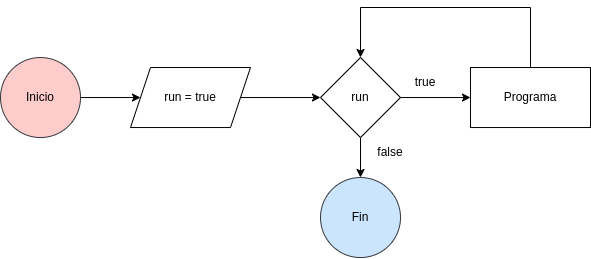
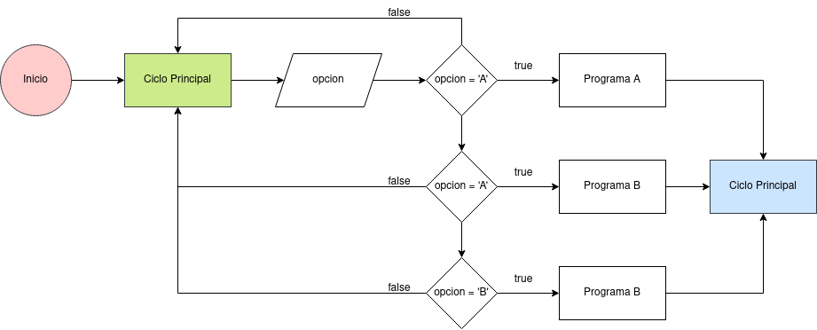
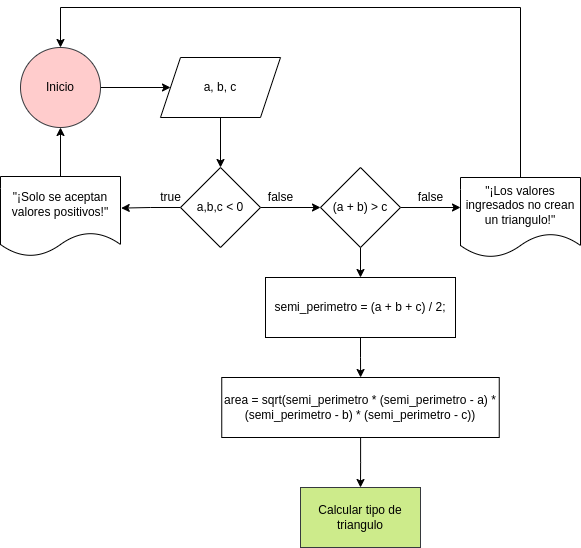
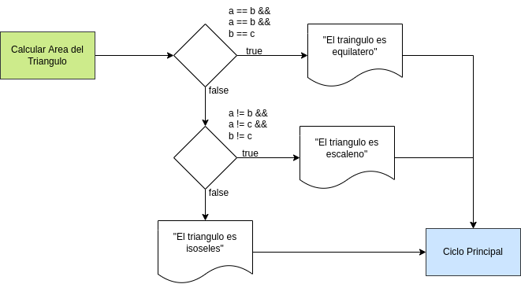

# Proyecto Final de Informatica I

## Programa de Inicio

El programa de inicio utiliza un ciclo `do` junto a una variable booleana `run`, de esta manera se obtiene a un programa que continuara ejecutando a no ser que el valor de `run` sea falso. 

Aca se le presenta al usuario una lista de programas disponibles y se captura la opción ingresada, este valor se evalua con una estructura de control `switch` para ejecutar cada ejercicio.

## Programa de Triangulos

El primer programa empieza capturando las 3 variables: `a`, `b` y `c`, de tipo `double` para no perder presición al momento de calcular el area del triangulo. Estas variables son entonces evualuadas en un condicional para verificar si una de ellas es negativa o igual a 0, de ser verdad entonces se muestrael error "¡Solo se aceptan valores positivos!", de ser falso se continua con otro condicional para evaluar si los valores ingresados crean un triangulo: `(a + b) > c`, de ser falso se muestra el error: "¡Los valores ingresados no crean un triangulo!". Con estos valores ya evaluados se calcula la formula de herron para obtener el area del triangulo.

Con el calculo del area completo, se evalua el tipo de triangulo con las medidas ingresadas.

